---
export_on_save:
    html: true
---

<a href="/index.html">HOME</a>

LANGUAGE

[English](tutor_record.html) | [简体中文](tutor_record_zhhans.html)

# Recording Tutorial
- Folder containing all recording files: `%USERPROFILE%/AppData/LocalLow/ElifGames/MoundofMusic/UGC/Record`

## File Description
- All recording files are in CSV format, as follows:

play_time|stop_time|pitch|instrument|misc
--|--|--|--|--
-1||||level:4021
8578|8636|-56|304	
10269|10365|-56|304
12076|12141|61|304

- The first row in the file is the header, and the data will not be loaded.
- The second row in the file contains miscellaneous data:
    - The first column is -1
    - The last column contains miscellaneous informations, such as level information for track recordings and string information for universal music boxes.
- From the third row onwards are the actual recording data:
    - play_time: The start time of the note in milliseconds; for example, 10.5 seconds should be written as 10500.
    - stop_time: The end time of the note in milliseconds.
    - pitch: The pitch key of the note; see [Pitch Data](#PitchData) for details.
    - instrument: The instrument key of the note; see [Instrument Data](#InstrumentData) for details.
- You can freely modify the data within the CSV file:
    - After saving and closing, you can preview the recordings in the recording studio at any time without restarting the game.
    - By modification, you can create original multi-track music.
    - By concatenating the play_time (divided by 1000) and pitch columns, you can use them as configuration data for Self-Compose.

---

## Configuration Data

### Pitch Data

Pitch Key|Chev System|Italiano System|Note Name|Corresponding Piano Key
--|--|--|--|--
41|1,|do,|c|C4
-41|#1,|dod,|#c|
42|2,|re,|d|D4
-42|#2,|red,|#d|
43|3,|mi,|e|E4
44|4,|fa,|f|F4
-44|#4,|fad,|#f|
45|5,|sol,|g|G4
-45|#5,|sold,|#g|
46|6,|la,|a|A4
-46|b7,|sib,|#a|
47|7,|si,|b|B4
51|1|do|c1|C5
-51|#1|dod|#c1|
52|2|re|d1|D5
-52|#2|red|#d1|
53|3|mi|e1|E5
54|4|fa|f1|F5
-54|#4|fad|#f1|
55|5|sol|g1|G5
-55|#5|sold|#g1|
56|6|la|a1|A5
-56|b7|sib|#a1|
57|7|si|b1|B5
61|1'|do'|c2|C6
-61|#1'|dod'|#c2|
62|2'|re'|d2|D6
-62|#2'|red'|#d2|
63|3'|mi'|e2|E6
64|4'|fa'|f2|F6
-64|#4'|fad'|#f2|
65|5'|sol'|g2|G6
-65|#5'|sold'|#g2|
66|6'|la'|a2|A6
-66|b7'|sib'|#a2|
67|7'|si'|b2|B6
- The game only supports pitches within these three octaves.

### Instrument Data

Instrument Key|Instrument Name|Picture
--|--|--
101|Celesta|
103|Marimba|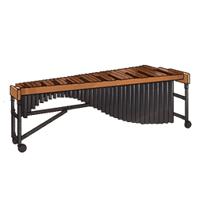
105|Mbira|
303|Harpsichord|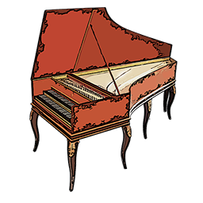
304|Piano|
306|Balalaika|
307|Banjo|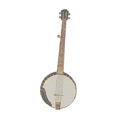
308|Cello|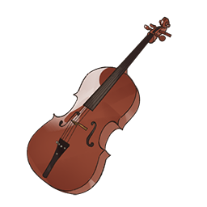
310|Guitar|
311|Harp|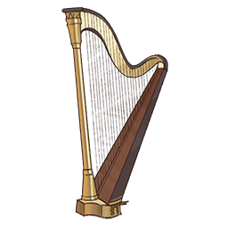
312|Lute|
314|Mandolin|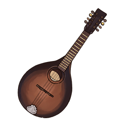
315|Oud|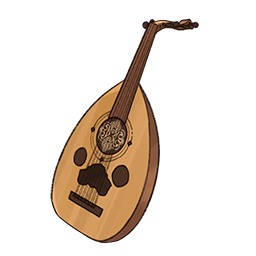
317|Shamisen|
318|Sitar|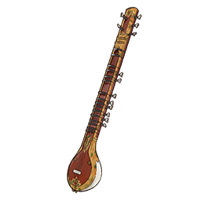
319|Ukulele|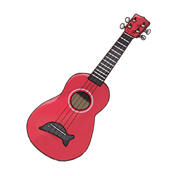
320|Violin|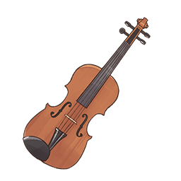
401|Accordion|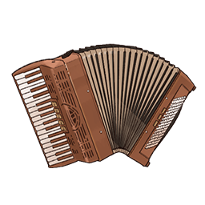
402|Harmonica|
404|Bagpipes|
405|Bassoon|
406|Clarinet|
407|Didgeridoo|
409|Flute|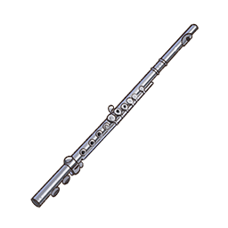
410|French Horn|
411|Oboe|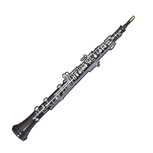
412|Ocarina|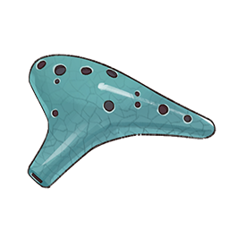
413|Organ|
415|Recorder|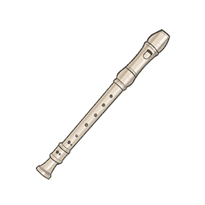
416|Saxophone|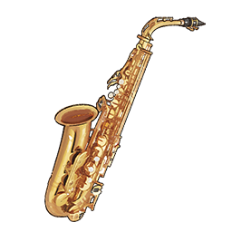
417|Shakuhachi|
418|Tin whistle|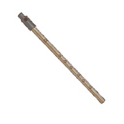
419|Trombone|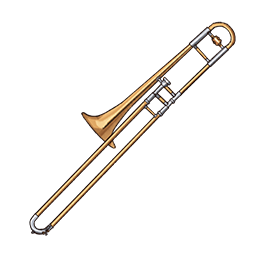
420|Trumpet|
601|Choir|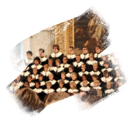
603|Music box|