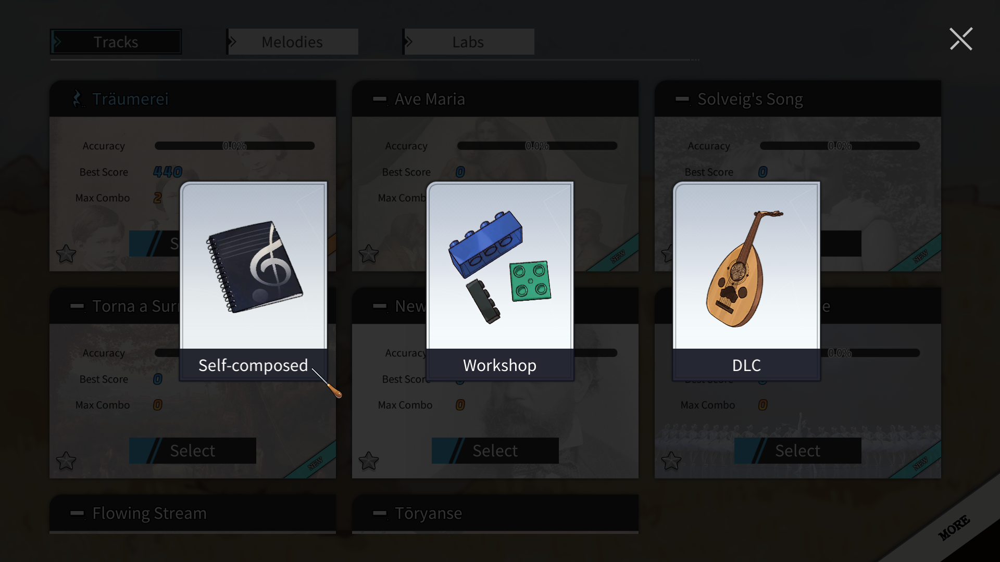
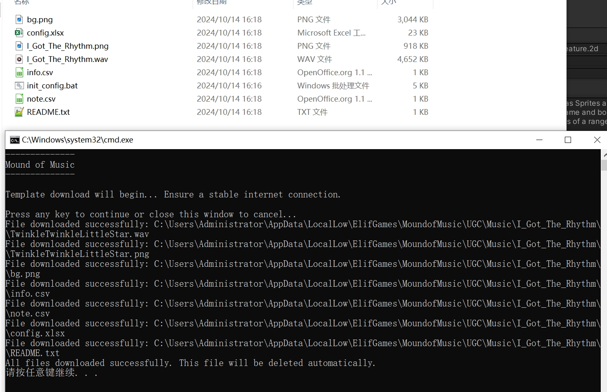
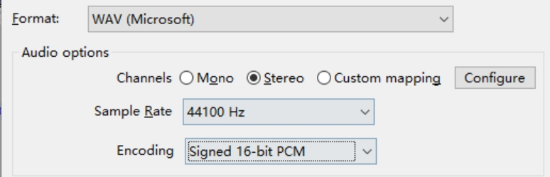

---
export_on_save:
    html: true
---

<a href="/index_zhhans.html">返回主页</a>

LANGUAGE

[English](tutor_compose.html) | [简体中文](tutor_compose_zhhans.html)

# Self-Compose Tutorial
- Folder containing all Self-Compose files: `%USERPROFILE%/AppData/LocalLow/ElifGames/MoundofMusic/UGC/Music`

## Creating a New Track Template
- First, go to the track selection screen and click on the `More` button at the bottom right corner to pop up the entrance for Self-Composed tracks. Click to enter.

- The Self-Composed track interface will list all existing tracks. Click on New to add.

- You can enter a new name for the Self-Composed track. This string will serve as the unique index name:
    - The final displayed name of the track can be different from this index name.
    - It must not duplicate any other index names.
    - Spaces are not allowed; if spaces are included in the input, they will be replaced with the `_` symbol.

- If the index name is correct, the game will automatically exit and enter the following folder:
    - If the transfer does not proceed normally, please copy this path to the file manager: `%USERPROFILE%/AppData/LocalLow/ElifGames/MoundofMusic/UGC/Music`

- Run the `init_config.bat` within it to synchronize the template files required for Self-Composed tracks.
    - A smooth internet connection is required; if you cannot connect, please join our discord to request the template files: [Click to Discord](https://discord.com/invite/SQ22XP4MKc)
    
    - If all downloads are successful, the `init_config.bat` file will automatically delete itself after execution.

- If all the above steps are correct, you will find an additional track named `TwinkleTwinkleLittleStar` in game.

---

## Track Content Editing
> Take the template file `TwinkleTwinkleLittleStar` as an example, please ensure that the track template was created correctly in the previous step.

### WAV File
- Filename: [Index Name].wav
- This file is the audio file for the background music, with the following requirements:
    - The filename must match the index name.
    - It must be a WAV file.
    - It must be stereo, encoded as 16bit-PCM.
    - The Sample Rate must be set to 44100 Hz, otherwise the track may sound out of tune when loaded into the game.
    - It is recommended that the first note of the actual configuration starts after 6 seconds; otherwise, there may be issues during note speed adjustment. If the prelude time is insufficient, you can add silence at the beginning of the track.

- If the audio file cannot be parsed correctly, it is recommended to download Audacity and re-export it:
[Download Audacity](https://www.audacityteam.org/download/)

### Track Image
- Filename: [Index Name].png
- This file is used as the image for the track in the selection interface and on the disc. The requirements are as follows:
    - The filename must match the index name.
    - It must be a PNG file.
    - If you upload to the Steam Workshop, the image will automatically be used as the cover. Due to Steam's own limitations, it is recommended that the image size should not exceed 1MB.
- It is recommended to create the file based on the size of the template to avoid subsequent adjustments to size and position.

### Background Image
- Filename: bg.png
- This file is used exclusively as the large background image for the track's start and end transitions. The requirements are as follows:
    - The filename must be: bg.png
    - It is not a required configuration; if this file is deleted, the default background image will be used automatically.

### info.csv
- This file is the configuration file for all track information.
- The CSV file can be edited with Excel, but it is recommended to use Libre Office Calc, which provides better compatibility with UTF-8 characters (especially non-English languages).
[Download Libre Office Calc](https://www.libreoffice.org/download/download-libreoffice/)
- The first row of the CSV file is the header, and subsequent rows contain the actual configuration data. Only the first two columns are used for the actual data.
- Explanation of each configuration data:

Key|Value (Default)|Description
--|--|--
name|Twinkle Twinkle Little Star|The displayed name of the track, which can be different from the index name.
scale_name|C|The key of the track, which affects the solfege names of the notes. Enter the key string. See [Scale Data](#ScaleData).
slice_start|7|The starting seconds of the track's WAV file preview that will loop during the track preparation phase.
slice_end|24|The ending seconds of the track's WAV file preview.
keytype|1|Key type: 1->7 keys, 2->12 keys. If your track uses accidentals, please use the 12-key setting.
composer|Wolfgang Amadeus Mozart|The composer's name, displayed during the preparation phase.
lyrics|Twinkle twinkle little star\nHow I wonder what you are!\nUp above the world so high\nLike a diamond in the sky|Lyrics, displayed only in transitions, use \n for line breaks, and avoid using `,` (it will cause CSV parsing errors).
copyright|Author: Elif Games|Copyright information, viewable by clicking the info button during the preparation phase.
pic_pos|0\|0\|0.5|The position and scale of the track image on the circular disc in the preparation phase: x pixel offset\|y pixel offset\|scale ratio.
card_pos|0\|0\|0.7|The position and scale of the track image on the square music card in the selection interface: x pixel offset\|y pixel offset\|scale ratio.
video|musicbg1|Video background, only supports built-in videos: musicbg1 - musicbg9.
fade_lose|0.2|The percentage the video darkens per second.
fade_hit|0.2|The percentage the video brightens with each triple hit.
alpha_area|0.05\|0.4|The transparency range of the video: minimum transparency\|maximum transparency.
version_info|First version.|Information on this version, and will be submitted to the Steam Workshop.

- All configuration files do not support multiple languages.

### note.csv
- This file is the configuration file for all notes of the track.
- The first row of the CSV file is the header, and subsequent rows contain the actual configuration data, with only the first three columns being used:
    - id: The sequence number of the note's appearance order.
    - pitch: The pitch key of the note, see [Pitch Data](#PitchData) for details.
    - time: The time at which the note appears, in seconds, supporting up to three decimal places, i.e., precise to milliseconds.
- It is recommended to use the `config.xlsx` to configure this file.

### config.xlsx
- This file is an auxiliary file used to generate `note.csv`, and the data will not be actually loaded.
- To configure pitch, please use the Sheet: `config`
    - First, record all the pitches of the notes in the track.
    - Choose to use either solfège or scientific pitch names to configure the data, but use only one method.
    - If using solfège, correctly select the key of the track in cell `B1`.
    - By default, use the scientific pitch name/Italian solmization notation. For details, refer to the content in Sheet: `data`. You can replace the content of the scientific pitch name/Italian solmization column with what you are familiar with to facilitate configuration.
    - The `Phrase` and `Lyrics` columns are only for auxiliary positioning.
    - If the configured pitch exceeds the supported range of the game, adjust it with `Octave Offset`. 1 indicates one octave up, and -1 indicates one octave down.
    - When all the `Check` columns are TRUE, the `Output Pitch` column is the `pitch` column in `note.csv`, which can be used as a backup.
- Configure timing points
    - It is recommended to use Audacity to collect the timing points of each note: [Download Audacity](https://www.audacityteam.org/download/)
    - Fill in the timing point data into the `Output Timing Points` column of the table.
- Combine `Output Pitch` and `Output Timing Points` data, and number them in sequence, as formatted in Sheet: `note.csv`, then overwrite the `note.csv` file.

### README.txt
- This is an instruction file; the data will not be actually loaded.

## Completion and Testing
- If all the above steps are completed smoothly, you can load the track in the game for testing.
- After modifying the data and closing the CSV file, there is no need to restart the game; just re-enter the level to refresh the content.
- Congratulations on successfully creating your own track! Please upload it to the Steam Workshop to share with friends all around the world!

---

## Configuration Data

### Scale Data

Scale Key|Scale Value in game|Description
--|--|--
C|1|C Major
C♯|2|C♯ Major
D|3|D Major
D♯|4|D♯ Major
E|5|E Major
F|6|F Major
F♯|7|F♯ Major
G|8|G Major
G♯|9|G♯ Major
A|10|A Major
A♯|11|A♯ Major, B♭ Major should also be noted as A♯
B|12|B Major
a|1|a Minor
a♯|2|a♯ Minor
b|3|b Minor
c|4|c Minor
c♯|5|c♯ Minor
d|6|d Minor
d♯|7|d♯ Minor
e|8|e Minor
f|9|f Minor
f♯|10|f♯ Minor
g|11|g Minor
g♯|12|g♯ Minor
- When the scale values in game are the same, indicating that they are related major and minor scales, and they are the same when using solfège as key bindings.

### Pitch Data

Pitch Key|Chev System|Italiano System|Note Name|Corresponding Piano Key
--|--|--|--|--
41|1,|do,|c|C4
-41|#1,|dod,|#c|
42|2,|re,|d|D4
-42|#2,|red,|#d|
43|3,|mi,|e|E4
44|4,|fa,|f|F4
-44|#4,|fad,|#f|
45|5,|sol,|g|G4
-45|#5,|sold,|#g|
46|6,|la,|a|A4
-46|b7,|sib,|#a|
47|7,|si,|b|B4
51|1|do|c1|C5
-51|#1|dod|#c1|
52|2|re|d1|D5
-52|#2|red|#d1|
53|3|mi|e1|E5
54|4|fa|f1|F5
-54|#4|fad|#f1|
55|5|sol|g1|G5
-55|#5|sold|#g1|
56|6|la|a1|A5
-56|b7|sib|#a1|
57|7|si|b1|B5
61|1'|do'|c2|C6
-61|#1'|dod'|#c2|
62|2'|re'|d2|D6
-62|#2'|red'|#d2|
63|3'|mi'|e2|E6
64|4'|fa'|f2|F6
-64|#4'|fad'|#f2|
65|5'|sol'|g2|G6
-65|#5'|sold'|#g2|
66|6'|la'|a2|A6
-66|b7'|sib'|#a2|
67|7'|si'|b2|B6
- The game only supports pitches within these three octaves.

---

## Other
### Tool to convert MIDI mono tracks to configuration
- Please download `mom_converter` tool here: https://github.com/gamefang/MOMTools/releases/download/v1.0/mom_converter.exe

- Convert MIDI files
    - Prepare a complete MIDI file of the track.
    - Extract the main melody track from it. You can use [MuseScore](https://musescore.org/en/download) to delete other tracks. If the main melody is distributed across multiple tracks, this method may not be suitable.
    - Export the main melody MIDI file, run `mom_converter`, and browse the MIDI file.
    - If it was successful, a `note_raw.csv`file will be generated. This file is consistent with the format of [note.csv](#notecsv).
    - MIDI files may have some parts that exceed 3 octaves. The script will also prompt when exporting, and you can use Excel to adjust them.

- Complete other configurations
    - Convert the complete track MIDI file to WAV to ensure that the timing of all notes is consistent with that converted by the script.
    - Follow the above tutorial to complete the remaining information.