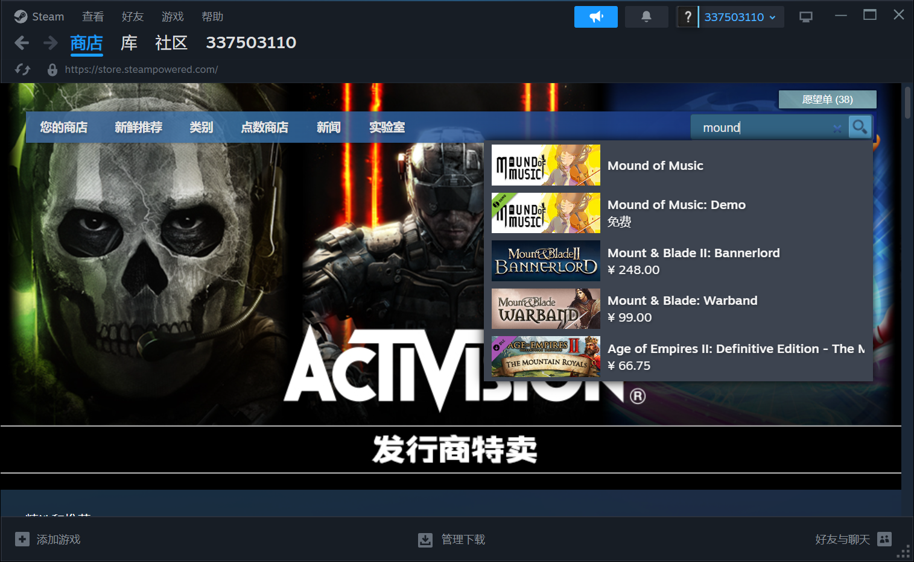

---
export_on_save:
    html: true
---

@import "lan.md"

# 【Long-term Offer】Free New Game for Old-Timer Players

Dear old-timer player,

Hello, I am Gamefang(Fang Heng), an independent game developer. As one of the developers of "MyCompany996", my new work "Mound of Music" is about to be completed. To express my gratitude, I would like to offer a free activation code for the new game to old-timer players.


"Mound of Music" is a narrative game themed around music, which tells a story full of ups and downs, and is interspersed with unique musical gameplay throughout. You can [CLICK HERE](https://store.steampowered.com/app/2911340/Mound_of_Music/) to learn more. If you are an old-timer player, simply add the game to your Steam wishlist and recommend a friend to do the same, and I will send you the official version of "Mound of Music" for free.

I have been developing games for over a decade and have focused on independent games for nearly seven years. Unless something extraordinary happens, I have at least another twenty to thirty years to make games. As a gamer for over thirty years, I understand that the probability of continuously playing multiple works by the same author is quite low, and that is undoubtedly the greatest honor for an author. Therefore, I am willing to open my new work for free to old players, and in the future, for any work I am responsible for, I hope to adhere to this principle: <b>As long as you continue to follow me, my new works will always be free for you.</b>

Of course, the path of independent game development is fraught with difficulties, and I also need some funds to cover living expenses. Therefore, free activation codes are limited to true old-timer players and require some verification. Please send me an email in the format detailed below.

A favor is worth a thousand gold coins. Players are not only my bread and butter but also the driving force behind my continuous creation. Whether or not you are willing to help promote the game to get a free activation code, it does not affect my gratitude towards you. Life is not easy, and I hope that every player can find their own spiritual needs in the game and expand the dimensions of our lives.

I wish you a pleasant gaming experience and all the best!

Additionally: If you have made a special contribution to "MyCompany996," such as creating high-quality videos, guides, etc., please let me know. I probably have an impression of most contributions, but I may not be able to match them to the right person, and there will be additional thanks!

Gamefang (Fang Heng)
Email: elifgamestudio@gmail.com

---

## Email Template
- It is recommended to copy the following template, modify it with your information, and send it to me.

```
To: elifgamestudio@gmail.com
Subject: Free New Game for Old-Timer Players
Content:

Hello,

(Choose one of the following) I am in the official QQ group for "MyCompany996" and have received your email.
(Choose one of the following) I have played "MyCompany996" on Steam. Here is a screenshot of my game library: [Paste your Steam library screenshot here].
(Choose one of the following) I have played "MyCompany996" on Taptap and given it a positive review: [Paste your Taptap review screenshot here].

Myself and another friend have added your new game "Mound of Music" to our wishlists. Here are the screenshots:
[Paste your wishlist screenshot here]
[Paste your friend's wishlist screenshot here]

Please verify and send the activation code for the official version of "Mound of Music" to this email, thank you!
```

## Verification Method for Old-Timer Players
- Old-Timer players are currently defined as those who have played the full version of "MyCompany996" through legitimate channels, as of May 31, 2024.
1. If you are in any of the QQ group of "MyCompany996 Official", I will send you an email directly and automatically recognize you as an old player without the need for additional proof.
2. 【Steam Library Screenshot】If you own "MyCompany996" on Steam, please follow the format below and send a screenshot with your Steam account information.


3. 【Taptap Review Screenshot】If you have played the trial version of "MyCompany996" on Taptap, even if you have not purchased the full version, as long as you provide a screenshot of a positive review within the time frame, you can also receive the activation code for the new game.


- If there are still omissions, please explain the situation and inform me by email.

## Wishlist Format Requirements
- Please follow the steps below to add "Mound of Music" to your wishlist.
    - Search for `mound` in Steam.
    
    - Click `Add to your wishlist` and feel free to `Follow` as well.
    

- 【Wishlist Screenshot】After adding to your wishlist, click on the top right to view your wishlist and search for `mound`, then save the following screenshot.


- Notify the friend you recommended to also send you this screenshot, then paste it in your email and send to me.
- After I verify it, I will send the activation code via email. As for whether your recommended friend ultimately purchases my game, that is certainly not something I can demand, but I still hope to keep the game on the wishlist to support me. Additionally, if there are duplicate Steam accounts found, or other suspected forgeries, I'm sorry, but I won't be able to provide the activation code... In short, I hope everyone treats each other with sincerity.