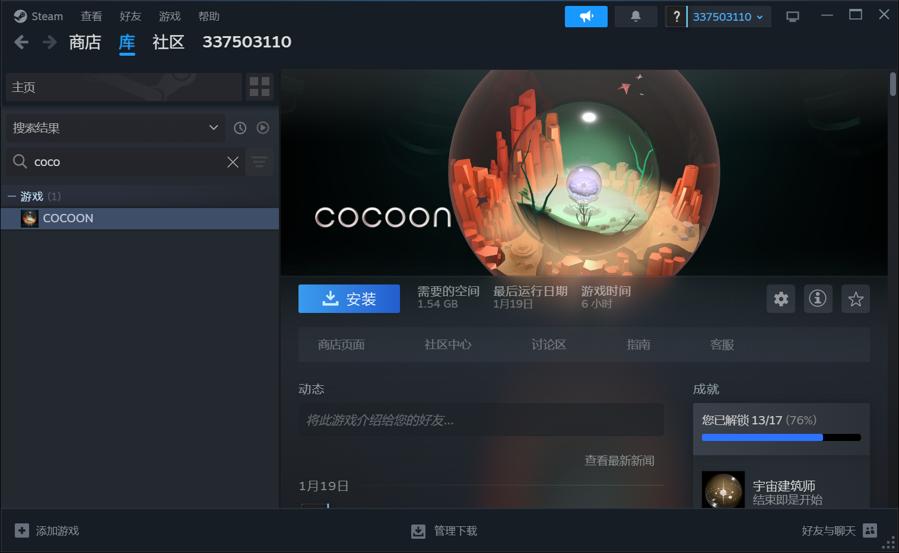

---
export_on_save:
    html: true
---

@import "lan.md"

# 【长期有效】老玩家免费奉送新游戏

亲爱的老玩家：

你好，我是独立游戏开发者gamefang(方珩)。作为《我的公司996》的开发者之一，目前个人新作《Mound of Music》即将完成开发，为表达谢意，我希望可以免费奉送新作的激活码给老玩家。


《Mound of Music》是一款音乐题材的叙事游戏，同样讲述了一个跌宕起伏的故事，并且以独特的音乐玩法贯穿始终，你可以[点击这里](https://store.steampowered.com/app/2911340/Mound_of_Music/)了解更多。如果你是老玩家，只需要将游戏加入Steam愿望单，并推荐你的一位朋友也将其加入愿望单，我就会免费发送给你《Mound of Music》正式版本的激活码，从而免费畅玩新作。

我已从事游戏开发十余年，并专注于独立游戏近七年，如果没有特殊情况，至少还有二三十年可以用来做游戏。作为30余年的游戏老玩家，我深知连续玩同一作者多个作品的概率很低，那无疑是作者最大的荣耀。所以，我愿意向老玩家免费开放我的新作，并且将来凡是我负责的作品，我都希望坚持这个原则：<b>只要你一直在关注着我，我的新作就会一直对你免费开放。</b>

当然，独立游戏开发之路毕竟困难重重，我也需要一定资金来负担生活费用，因此免费激活码仅限真正的老玩家，需要稍作核实。请按格式给我发送邮件即可，具体方式详见下述说明。

一饭之恩值千金，玩家不仅是我的衣食父母，更是我持续创作的动力。无论你是否愿意帮忙推荐游戏而获得免费激活码，都不影响我对你的感恩之情。现实生活不易，愿每位玩家都能在游戏中找到自己的精神所需，扩展我们生命的维度。
    
祝游戏愉快，万事顺遂！

另：如果你之前为《我的公司996》做过特殊贡献，如做过高质量视频、攻略等等，请一定告知我，我多数应该都有印象，只是对不上号，定有额外感谢！

gamefang(方珩)
邮箱: elifgamestudio@gmail.com

---

## 邮件模板
- 建议直接复制以下模版内容，修改为你的信息，发送给我即可。

```
收件人: elifgamestudio@gmail.com
主题: 老玩家免费奉送新游戏
内容:

你好，

（三选一）我在《我的公司996》游戏的官方QQ群，已收到你的邮件。
（三选一）我在Steam玩过《我的公司996》，这是我游戏库中的截图：[粘贴Steam入库截图]
（三选一）我在Taptap玩过《我的公司996》，并给予了好评：[粘贴Taptap评价截图]

我对你的新作《Mound of Music》感兴趣，我自己以及另一位朋友已将游戏加入愿望单，以下是截图：
[粘贴你的愿望单截图]
[粘贴你朋友的愿望单截图]

请核实无误后，将《Mound of Music》正式版的激活码发送至本邮箱，谢谢！

```

## 老玩家核实方式
- 老玩家目前是指通过正规渠道玩过《我的公司996》完整版的玩家，截止日期为2024年5月31日。
1. 如果你在《我的公司996官方群》其中任意一个群，我都会直接发送邮件给你，并自动判定为老玩家，无需额外证明。
2. 【Steam入库截图】如果你在Steam上已拥有《我的公司996》，请参照以下格式，发送带有Steam账号的真实截图。


3. 【Taptap评价截图】如果你在Taptap上玩过《我的公司996》试玩版，即使未购买完整版，只要参照以下格式，提供在时间范围内游戏好评的截图，也可以得到新作的激活码。


- 如果以上仍有遗漏，请说明情况并邮件告知我。

## 愿望单格式要求
- 请先按如下步骤，将《Mound of Music》加入愿望单
    - 在Steam中搜索`mound`
    
    - 点击`添加至您的愿望单`，也欢迎点击`关注`
    

- 【愿望单截图】完成愿望单添加后，请点击右上角查看自己的愿望单，并搜索`mound`，保存如下截图


- 通知你推荐的朋友，也将此截图发给你，然后贴入邮件，发送至我的邮箱即可。
- 我在核实无误后，会通过邮件发送激活码。至于你推荐的朋友最终是否购买我的游戏，这当然不能强求，但还是希望尽量保持游戏在愿望单内，捧个人场。另外，如果发现有重复出现的Steam帐号，或者其他伪造嫌疑等，就抱歉不能给激活码了……总之，希望大家互相以诚相待。